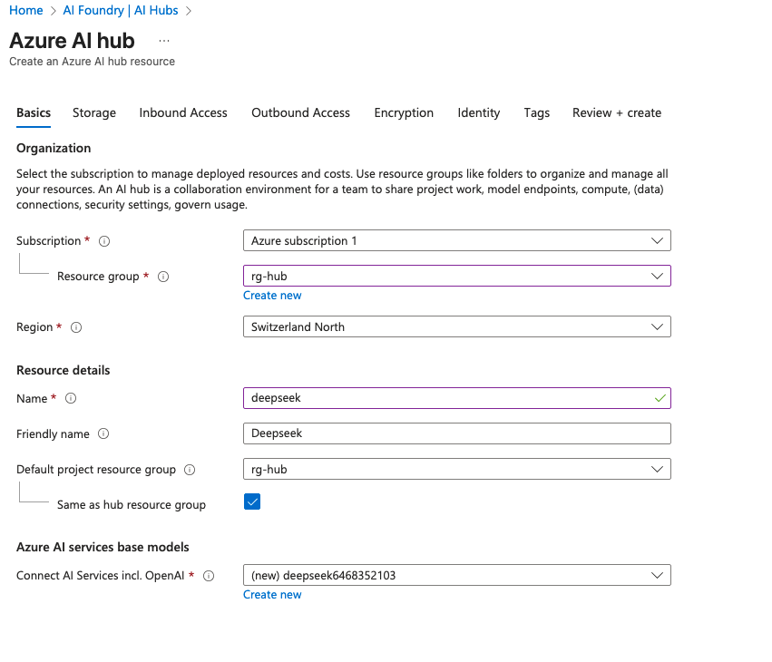
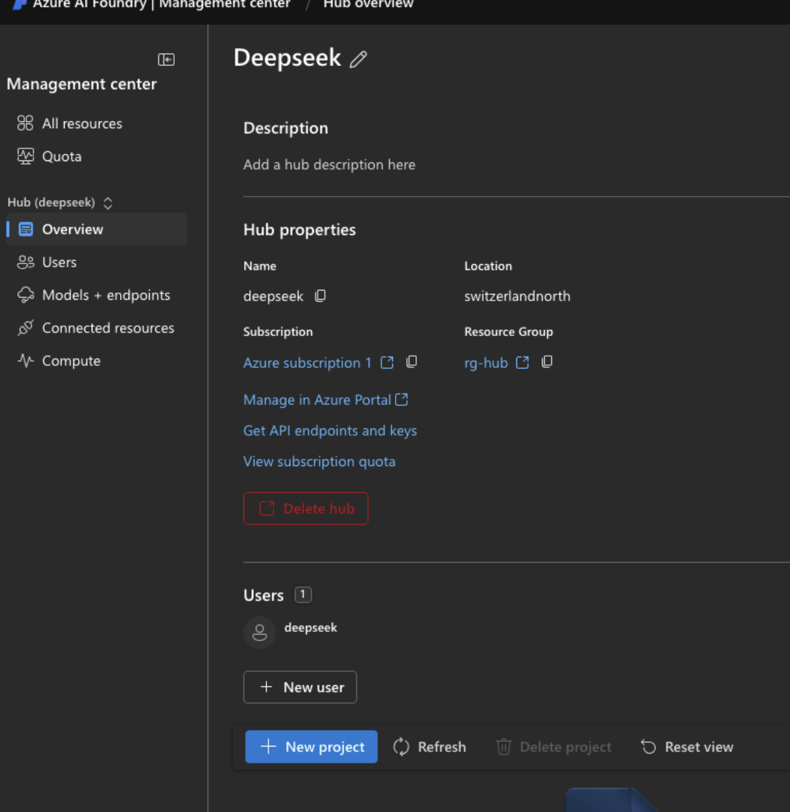
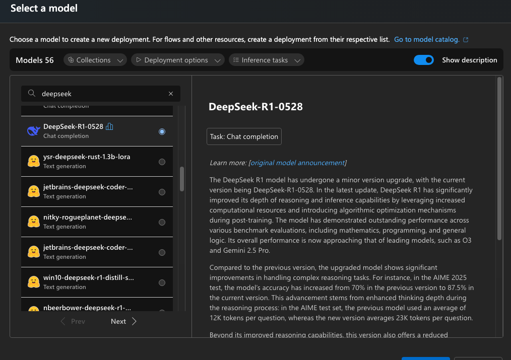
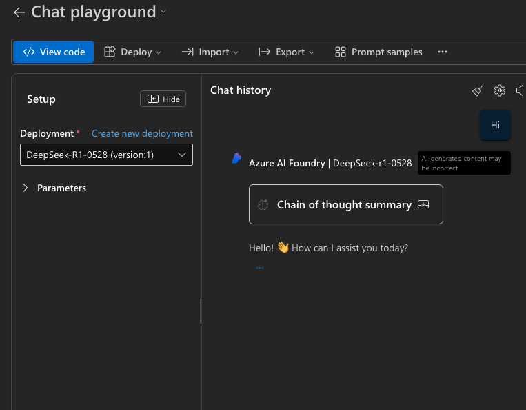
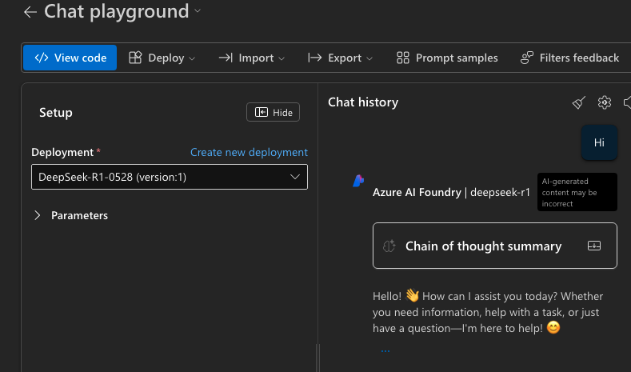
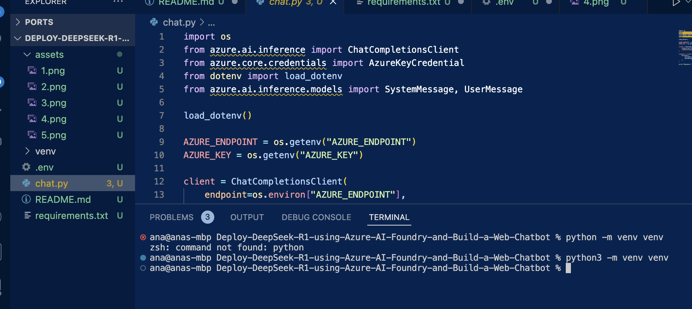
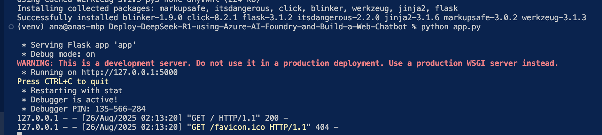
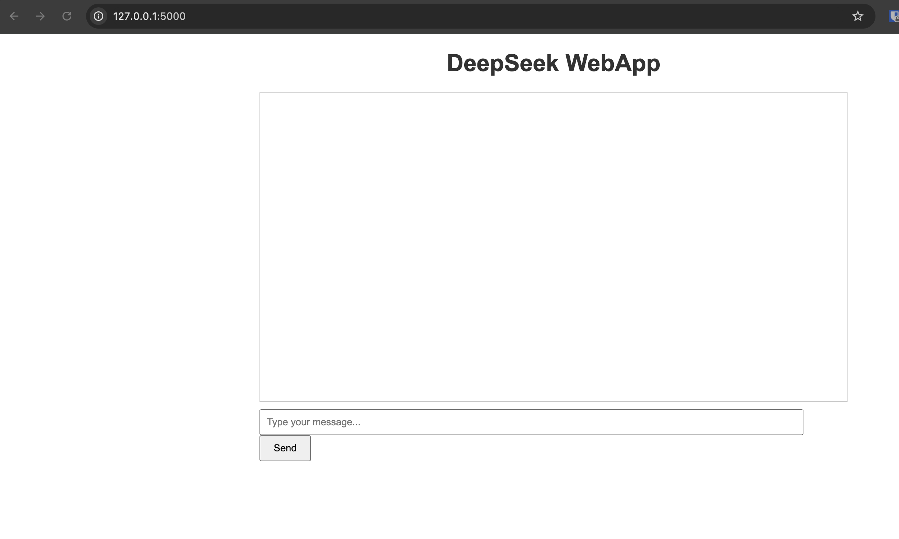
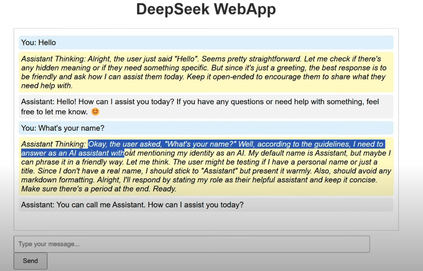

# Description

Deploy DeepSeek R1 using Azure AI Foundry and Build a Web Chatbot

# Steps

Go to AI Foundry and create an AI hub:

The rest of parameters as default

Once deployed, launch the AI Foundry and create a new project:

Go to models and endpoints and click Deploy base model and click the Deepseek-R1 model:

Open the chat playground:

Now let's build a local web app. For that we use the code

We create a chat.py script and add the Azure endpoint and key from Models + endpoint section

# Results

We create an app.py script as well and execute them in the terminal. Click on the url that appears and the Web app is there!

Let's ask some questions to the model:

And it works pretty well!!
